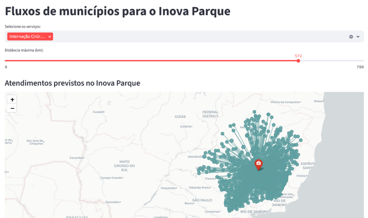
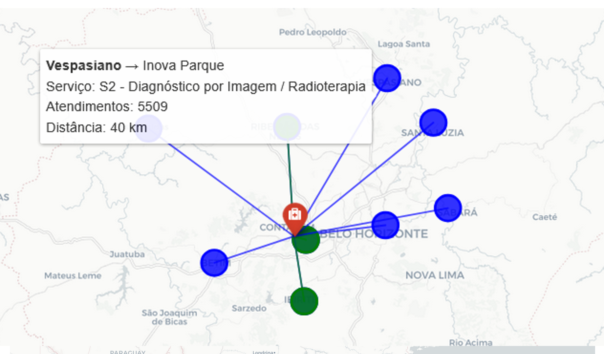

# Visualizações Georreferenciadas do Modelo de Dimensionamento Hospitalar

O aplicativo hospedado em [https://inovaparque.streamlit.app/](https://inovaparque.streamlit.app/) e ilustrado na **Figura 1** permite a visualização georreferenciada dos resultados gerados a partir de um modelo matemático de dimensionamento hospitalar. Essa ferramenta interativa facilita a análise espacial da demanda por serviços hospitalares, permitindo que usuários explorem diferentes configurações de cobertura territorial e observem como a localização geográfica influencia a atratividade e a demanda potencial para o hospital planejado no Inova Parque, em Contagem (MG).

  

**Figura 1**: Aplicativo web para visualizações georreferenciadas resultantes do modelo matemático.

---

O aplicativo permite a visualização de diferentes raios de cobertura, com variações entre 60 e 700 km dependendo do tipo de serviço ofertado. Com isso, o aplicativo permite visualizar os efeitos dessas variações no raio de cobertura sobre a demanda estimada, auxiliando decisões no planejamento de infraestrutura hospitalar.  

  

**Figura 2**: Detalhamento do município de origem, distância até o Inova Parque, tipo de serviço a ser realizado e estimativa anual de demanda atendida.

---

A ferramenta mostra, como ilustrado na **Figura 2**, a origem, tipo de serviço, distância até o Inova Parque e atendimento previsto da demanda deste município pelo hospital do Inova Parque. É possível observar uma demanda menor para municípios mais distantes devido ao menor nível de atratividade, modelado por uma função de decaimento exponencial em relação à distância.
